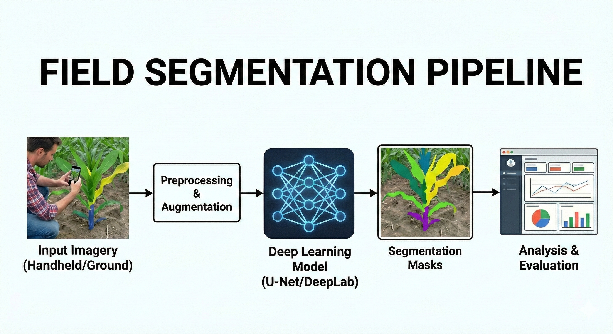

# Field Segmentation



Field Segmentation is a modular, configuration-driven deep learning pipeline for semantic segmentation and high-resolution object detection of field imagery. The repository supports mask generation, preprocessing, training, inference, and evaluation within a unified and reproducible framework.

The system is built using PyTorch Lightning, Hydra, and `segmentation_models_pytorch`, enabling scalable experimentation and clean configuration management.

## Overview

This repository provides an end-to-end segmentation workflow:

* Mask generation
* Data preprocessing, augmentation, and transformation
* Model training with configurable architectures
* Semantic segmentation training
* High-resolution YOLO object detection training
* Inference and transfer to LTS storage
* Evaluation and visualization
* Structured experiment management per project

All major behaviors are controlled via Hydra configuration groups, enabling reproducible experiments without modifying source code.

## Repository Structure

```text
field_segmentation/
├── README.md
├── LICENSE
├── environment.yaml
├── setup.sh
├── requirements.txt
├── uv.lock.txt
├── main.py
├── conf/
├── src/
├── projects/
└── .github/
```

### Configuration (`conf/`)
Hydra configuration groups:

* `paths/` – Filesystem paths
* `model/` – Model architecture configuration
* `train/` – Optimizer, scheduler, training settings
* `augment/` – Data augmentation configuration
* `preprocess/` – Resizing, normalization, mask remapping
* `maskgen/` – Mask generation and refinement settings
* `llm/` – Large Language Model configuration
* `inference/` – Inference and evaluation configuration
* `evaluation/` – Metrics and visualization settings
* `hydra/` – Logging and runtime behavior

### Source Code (`src/`)
* `utils/` – Utilities (GPU handling, seeding, logging)
* `train_utils/` – Training helpers and visualizers
* `inference_utils/` – Inference and evaluation utilities
* `detect_utils/` – Object detection utilities
* `preprocess_utils/` – Dataset preparation utilities
* `mask_gen_utils/` – Mask post-processing utilities
* `llm_utils/` – LLM integration utilities

Mode entrypoints: `train.py`, `maskgen.py`, `preprocess.py`, `inference.py`, `llm.py`, `detect.py`

## Installation

### 1. Clone the Repository:

```bash
git clone [https://github.com/](https://github.com/)<your-org>/field_segmentation.git
cd field_segmentation
```

### 2. Configure and Run the Setup Script

The project utilizes `uv` for blazingly fast, reproducible environment builds. The included `setup.sh` script will automatically check for `uv`, detect your system's CUDA version, anchor the correct PyTorch GPU wheel, and resolve all remaining dependencies.

Run the script using the default configuration (Python 3.10 and auto-detected CUDA):

```bash
bash setup.sh
```

#### Advanced Configuration (Optional)
You can override the default settings directly in your terminal without modifying the script:

* **Test a newer Python version:**
  ```bash
  PYTHON_VERSION=3.11 bash setup.sh
  ```
* **Force a specific CUDA wheel version (e.g., cu124):**
  ```bash
  TORCH_CUDA=cu124 bash setup.sh
  ```
* **Specify a custom environment folder name:**
  ```bash
  VENV_DIR=custom_env bash setup.sh
  ```

### 3. Activate the Environment

Once the script finishes successfully, activate the isolated virtual environment:

```bash
source .field_segmentation/bin/activate
```

*(Note: If you specified a custom environment name via `VENV_DIR`, replace `.field_segmentation` with your custom folder name).*

### (deprecated) Alternatively, create the Environment using Conda:

```bash
conda env create -f environment.yaml
conda activate field_segmentation
```
*Alternatively, install dependencies manually from `environment.yaml`.*

### LLM Setup (Ollama)

This project requires Ollama for local model inference. Follow these steps to install and run it without root/sudo access.

---

#### 1. System-Wide Install (Requires sudo)

To install Ollama, run the following command:
```bash
curl -fsSL https://ollama.com/install.sh | sh
```

#### 2. Manual User-Only Install

Download and extract the Ollama bundle directly into your home directory:

```bash
# Create local directory structure
mkdir -p ~/.local

# Download and extract the full bundle (no sudo required)
curl -L https://ollama.com/download/ollama-linux-amd64.tar.zst | tar --zstd -xvf - -C ~/.local

# Add the binary to your PATH
# (Add this line to your ~/.bashrc for a permanent fix)
export PATH=$PATH:$HOME/.local/bin
```

## Usage

The project uses a single Hydra-based entry point:

```bash
python main.py mode=<mode>
```

Available modes: `maskgen`, `preprocess`, `train`, `inference`, `llm`, `detect`.

### Mask Generation
Generates segmentation masks.

```bash
python main.py mode=maskgen
```
* **Configuration:** `conf/maskgen/default.yaml`
* **Supports:**
    * Classical thresholding with morphological cleanup
    * Model-based refinement
    * Manual quality control overlays

### Preprocessing
Performs resizing, normalization, cropping, mask remapping, train_val_test split and pad_gridcrop_resize.

```bash
python main.py mode=preprocess
```
* **Configuration:** `conf/preprocess/default.yaml`

### Training
Trains a segmentation model using PyTorch Lightning.

```bash
python main.py mode=train
```

Override configuration inline:

```bash
python main.py mode=train model=segformer train.max_epochs=50 train.batch_size=8
```
* **Configuration groups:**
    * `conf/model/`
    * `conf/train/`
    * `conf/augment/`

### Inference
Runs model inference using a trained checkpoint.

```bash
python main.py mode=inference inference.checkpoint_path=path/to/checkpoint.ckpt
```
* **Supports:**
    * Normalization
    * Threshold adjustment
    * Mask saving
    * Overlay saving
* **Configuration:** `conf/inference/default.yaml`

### Object Detection (YOLO)
The pipeline features a fully integrated, high-resolution object detection engine optimized for agricultural targets using Ultralytics YOLO architectures (YOLOv8, YOLOv11, YOLO26).

**Training:**
Executes YOLO training with multi-GPU DDP support, automated chronological directory sorting, and optimized field augmentations.

```bash
python main.py mode=detect detect.task=train model=yolo26s_detect
```

**Inference:**
Runs batch inference with strict spatial grid enforcement.

```bash
python main.py mode=detect detect.task=inference
```

### Model Architectures

Model configurations are located in: `conf/model/`

Currently supported:
* SegFormer (MiT-B0 to MiT-B5): Hierarchical Vision Transformer with a global receptive field and lightweight MLP decoder (State-of-the-art for contiguous agricultural features).
* UNet: Standard CNN encoder-decoder.
* DeepLabV3+: CNN with Atrous Spatial Pyramid Pooling (ASPP).

Models are instantiated via Hydra and wrapped in a LightningModule defined in `src/models/lit_segmentation.py`.

### LLM Integration (Ollama)

Ollama operates as a client-server model. You must have the server running before executing the code.

### Start the Server
In a separate terminal or tmux session, run:

```bash
ollama serve
```

### Pull the Model
Download the required weights:

```bash
ollama pull granite4
```

### Run the Pipeline
Execute your script:

```bash
python main.py
```

### Data Augmentation

Configured in: `conf/augment/default.yaml`

Includes:
* Spatial augmentations (flip, rotate, crop)
* Photometric augmentations (color jitter, blur)
* Batch-level augmentations:
    * MixUp
    * CutMix
    * Mosaic

Augmentations are dynamically composed in `src/data/augmentation.py`.

### Evaluation

Configured in: `conf/evaluation/default.yaml`

Because agricultural field imagery is highly imbalanced (often >90% background dirt), the evaluation pipeline is split into strict categories using `TorchMetrics` to prevent artificial inflation of scores.

**1. Foreground Metrics (Strict Evaluation)**
These metrics ignore the background class (`ignore_index: 0`) and strictly evaluate the model's ability to segment the plant canopy:
* Foreground IoU (Jaccard Index): The primary metric for spatial overlap.
* Foreground Dice (F1 Score): Slightly more forgiving on edge boundaries.
* Precision & Recall: Tracks false positives (hallucinated weeds/plants) and false negatives (missed canopy).

**2. Threshold-Independent Metrics (Rigorous Evaluation)**
Evaluates the model's probabilistic understanding across all thresholds (0.0 to 1.0) instead of a fixed 0.5 threshold:
* PR-AUC (Precision-Recall Area Under Curve): The definitive gold-standard metric for this pipeline. It plots Precision vs. Recall across all thresholds, entirely ignoring True Negatives (dirt).
* AUROC: Receiver Operating Characteristic curve.

**3. Global Metrics (Contextual)**
* Mean IoU / Mean Dice
* Accuracy (Monitored purely to demonstrate the baseline imbalance).

## Project Organization

Experiments are organized under: `projects/{project.name}/`

Example:
```text
projects/my_project/
├── mask_gen/
│   ├── developed-images/
│   ├── cutouts/
│   ├── refined_masks/
│   └── db/
```

This structure ensures that each project maintains its own:
* Raw images
* Generated masks
* Refined masks
* Metadata
* Outputs and reports

### Logging and Outputs

Hydra automatically creates versioned output directories:

```text
projects/<project>/train/version_YYYYMMDD_HHMMSS/
```

Outputs include:
* Model checkpoints
* Logs
* Augmentation visualizations
* Inference results
* Evaluation reports

Custom logging configuration is defined in: `conf/hydra/job_logging/custom.yaml`

Extensive logging through weights and biases (W&B) is supported for training and inference pipelines.

## Reproducibility

The repository supports reproducible experimentation through:
* Global seed control
* Structured Hydra configuration snapshots
* Deterministic training options
* Versioned output directories

### Continuous Integration

CI configuration is defined in: `.github/workflows/ci.yaml`

## Example Training Command

```bash
python main.py \
  mode=train \
  model=segformer \
  train.max_epochs=50 \
  train.batch_size=8 \
  augment.train.batch.mixup.enable=True
```

## License

See the `LICENSE` file for licensing details.