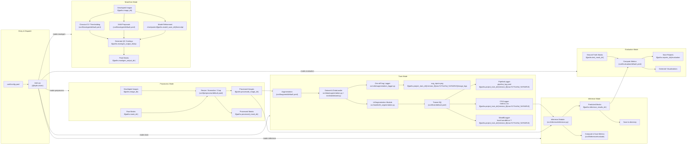

```mermaid
flowchart LR
  %% Entry & Dispatch
  subgraph Entry["Entry & Dispatch"]
    direction LR
    CFG["conf/config.yaml"]
    MAIN["main.py<br/>(@hydra.main)"]
  end
  CFG --> MAIN

  MAIN -->|mode=preprocess| PRE["Preprocess Mode"]
  MAIN -->|mode=maskgen| MASK["MaskGen Mode"]
  MAIN -->|mode=train| TRAIN["Train Mode"]
  MAIN -->|mode=inference| INF["Inference Mode"]
  MAIN -->|mode=evaluation| EVAL["Evaluation Mode"]

  %% Preprocess
  subgraph PRE["Preprocess Mode"]
    direction TB
    RawImgs["Developed Images<br/>${paths.image_dir}"]
    RawMasks["Raw Masks<br/>${paths.mask_dir}"]
    RawImgs --> PSTEP["Resize / Normalize / Crop<br/>(conf/preprocess/default.yaml)"]
    RawMasks --> PSTEP
    PSTEP --> ProcImgs["Processed Images<br/>${paths.processed_image_dir}"]
    PSTEP --> ProcMasks["Processed Masks<br/>${paths.processed_mask_dir}"]
  end

  %% MaskGen
  subgraph MASK["MaskGen Mode"]
    direction TB
    SourceImgs["Developed Images<br/>${paths.image_dir}"]
    SourceImgs --> CVSTEP["Classical CV Thresholding<br/>(conf/maskgen/default.yaml)"]
    SourceImgs --> SAMSTEP["SAM Proposals<br/>(conf/maskgen/default.yaml)"]
    SourceImgs --> REFSTEP["Model Refinement<br/>checkpoint=${paths.model_save_dir}/best.ckpt"]
    CVSTEP & SAMSTEP & REFSTEP --> QCSTEP["Generate QC Overlays<br/>${paths.maskgen_output_dir}/qc"]
    QCSTEP --> FinalMasks["Final Masks<br/>${paths.maskgen_output_dir}"]
  end

  %% Train + Logging
  subgraph TRAIN["Train Mode"]
    direction TB
    ProcImgs --> AUGSTEP["Augmentation<br/>(conf/augment/default.yaml)"]
    AUGSTEP --> DATALOAD["Dataset & DataLoader<br/>src/data/augmentation.py + src/data/dataset.py"]
    DATALOAD --> PRELOG["One-off Aug Logger<br/>src/utils/augmentation_logger.py"]
    PRELOG --> AugImgs["aug_inputs.png<br/>${paths.project_train_dir}/version_${now:%Y%m%d_%H%M%S}/image_logs"]
    DATALOAD --> LITMOD["LitSegmentation Module<br/>src/models/lit_segmentation.py"]
    LITMOD --> FITSTEP["Trainer.fit()<br/>(conf/train/default.yaml)"]
    FITSTEP --> PIPELOG["PipelineLogger<br/>pipeline_log.yaml<br/>${paths.project_train_dir}/version_${now:%Y%m%d_%H%M%S}"]
    FITSTEP --> CSVLOG["CSVLogger<br/>metrics.csv<br/>${paths.project_train_dir}/version_${now:%Y%m%d_%H%M%S}"]
    FITSTEP --> WANDBLOG["WandBLogger<br/>local:/wandb/run-*/<br/>${paths.project_train_dir}/version_${now:%Y%m%d_%H%M%S}"]
  end

  %% Inference
  subgraph INF["Inference Mode"]
    direction TB
    CSVLOG --> INFMOD["Inference Module<br/>(src/inference/inference.py)"]
    ProcImgs --> INFMOD
    INFMOD --> PredMasks["Predicted Masks<br/>${paths.inference_results_dir}"]
    PredMasks --> SaveOut["Save to directory"]
    INFMOD --> MetricsOut["Compute & Save Metrics<br/>(conf/inference/evaluate)"]
  end

  %% Evaluation
  subgraph EVAL["Evaluation Mode"]
    direction TB
    PredMasks --> EvalStep["Compute Metrics<br/>(conf/evaluation/default.yaml)"]
    GroundTruth["Ground-Truth Masks<br/>${paths.test_mask_dir}"] --> EvalStep
    EvalStep --> ReportOut["Save Reports<br/>${paths.reports_dir}/evaluation"]
    EvalStep --> VizOut["Generate Visualizations"]
  end
```
